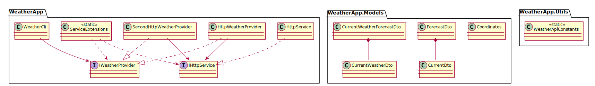

# Dependency Inversion (DIP)

## Summary

- **Description:** Implementation of a CLI-based weather application demonstrating Dependency Inversion Principle via abstractions `IWeatherProvider` and `IHttpService`. The CLI (`WeatherCli`) depends on `IWeatherProvider` and providers fetch weather data through HTTP services (`HttpWeatherProvider`, `SecondHttpWeatherProvider`) decoupled via `IHttpService`.
- **Discovered Tasks:** See **Scanned Comments Classification** below for the list and classification of TODO/OPTIONAL comments identified during task discovery.
- **Design Decisions & Patterns Used:**
  - Applied **Dependency Inversion Principle** by depending on abstractions (`IWeatherProvider`, `IHttpService`) rather than concrete implementations.
  - Used **Strategy Pattern** to switch between different weather providers (`HttpWeatherProvider`, `SecondHttpWeatherProvider`) via configuration in `ServiceExtensions`.
  - Utilized **Factory Method Pattern** in `ServiceExtensions` for conditional service registration (selecting provider implementation).
  - Implemented **Extension Methods** (`AddCliServices`) to configure DI container.
  - Employed **Value Object** (`Coordinates`) to encapsulate parsing and validation logic.

## Definition

High-level modules must not depend on low-level modules; both should depend on abstractions. Abstractions must not depend on details. Details depend on abstraction therefore, in C# we are talking about interfaces.

## Example

We want a CLI tool that prints today's temperature for a city. The first pass wires the high-level CLI directly to an HTTP-fetching service.

## CLI Usage
```bash
dotnet run --project WeatherApp/WeatherApp.csproj -- 10.5,20.3
```

## Solution (bad)

```csharp
namespace WeatherApp;

public class WeatherReporter
{
  private readonly HttpClient _http = new();

  public async Task<double> GetTodayAsync(string coordinates)
  {
    var latitude = coordinates.Split(',')[0];
    var longitude = coordinates.Split(',')[1];
    var url = $"https://api.open-meteo.com/v1/forecast?latitude={latitude}&longitude={longitude}&current=temperature_2m,wind_speed_10m&hourly=temperature_2m,relative_humidity_2m,wind_speed_10m";
    var response = await _http.GetFromJsonAsync<ForecasDto>(url);

    return response!.current.temperature_2m;
  }
}
```

Problems:

- Unit testing would be difficult because we might need to mock a complex API.
- If we change the API, we must modify the Reporter
- High-level policy (what to do with the api) is coupled to low-level detail (how to fetch the json)

## Solution (enhanced)

Define an abstraction `IWeatherProvider`. The CLI Logic depends only on that interface. Concrete providers `HttpWeatherProvider`. And all via Depedency Injection.


## Difference between Dependency Injection and Dependency Inversion

> Note: To apply Dependency Inversion applying Depedency Injection is not a must.

- Dependency Injection: It is a techinique, it is a way, it is a pattern of using interfaces to apply any concrete classes
- Dependency Inversion: It is a design principle...

### Scanned Comments Classification

| File                                               | Comment                                                                                | Classification |
|----------------------------------------------------|----------------------------------------------------------------------------------------|----------------|
| `WeatherApp.Tests/Cli/TestWatherCli.cs`            | `// TODO: Find the best way to test the cli`                                           | Required       |
| `WeatherApp/Services/HttpWeatherProvider.cs`       | `// TODO: Create a level of http abstraction for http requests into HttpService with provided url` | Required       |
| `WeatherApp/Services/HttpWeatherProvider.cs`       | `// TODO: Apply validators or error handling for response`                             | Required       |
| `WeatherApp/Services/SecondHttpWeatherProvider.cs` | `// OPTIONAL: Search for a new endpoint to get the weather (refactor scaffolding for models)` | Optional       |
| `WeatherApp/Program.cs`                            | `// TODO: Enable switch between providers (using CLI arguments)`                       | Required       |
| `WeatherApp/Program.cs`                            | `// OPTIONAL: Create extensions for the following`                                     | Optional       |
| `WeatherApp/Cli/WeatherCli.cs`                     | `// TODO: Create validator for the args`                                               | Required       |
| `WeatherApp/Cli/WeatherCli.cs`                     | `// OPTIONAL: Separate the arguments`                                                  | Optional       |
| `WeatherApp/Cli/WeatherCli.cs`                     | `// TODO: Validate that coordinates are valid coordinates`                             | Required       |

## UML Class Diagram


