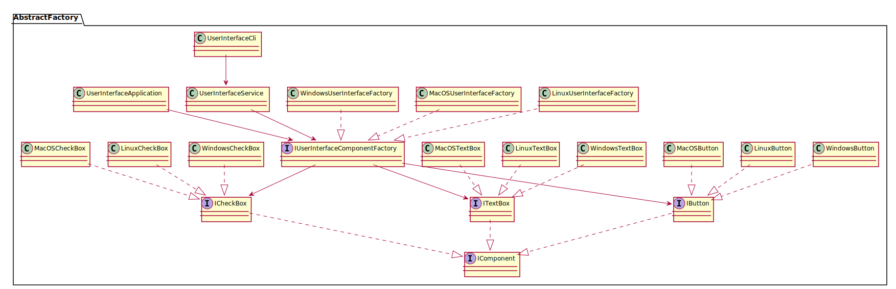

# Abstract Factory

Abstract Factory is a creational design pattern that lets you produce families of related objects without specifying their concrete classes.

## Example

We are going to create a console application that will show a Cross Platform Component System where we need to create families of related UI components for different operating systems.

## CLI Usage
```bash
dotnet run --project AbstractFactory/CrossPlatform/CrossPlatform.csproj -- windows
```

## 🔷 UML Diagram



