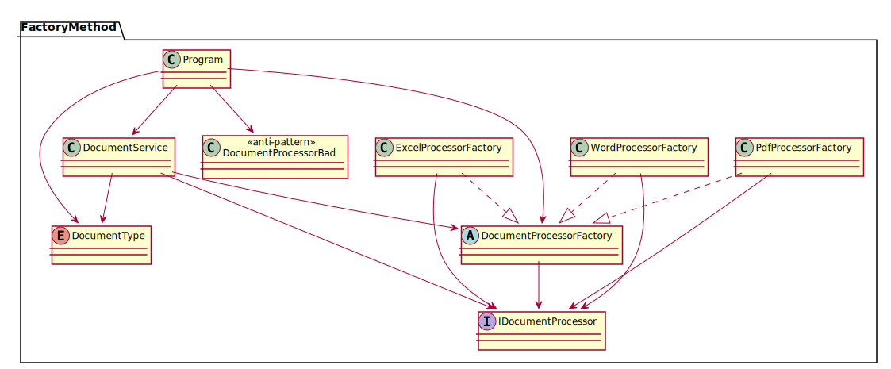

# Factory Method

Factory Method is a creational design pattern that provides an interface for creating objects in a superclass, but allows subclasses to alter the type of objects that will be created.

## Example

We are going to demonstrate a Document Processing System where we need to handle different types of documents (PDF, Word, Excel, etc.)

## CLI Usage
```bash
dotnet run --project FactoryMethod/DocumentProcessor/DocumentProcessor.csproj -- Pdf "This is the document content"
```

## 🔷 UML Diagram



