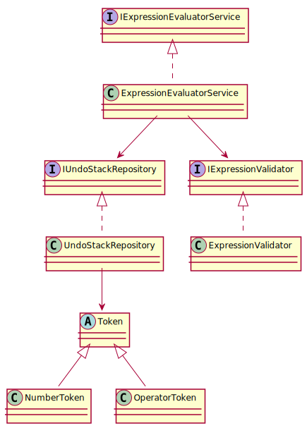

# Problem 1 - Expression Evaluator with Undo

## Overview
This console application simulates a basic arithmetic expression evaluator with undo functionality. It supports:

- Entering numbers and basic arithmetic operators (`+`, `-`, `*`, `/`)
- Evaluating the current expression
- Undoing the last input (number or operator)
- Clearing the entire expression stack

It uses Clean Architecture, Dependency Injection, and the Command Pattern for modular command execution.

---

## 🧱 Architecture

```
Problem1/
├── Cli/                  # Entry point using Microsoft.Extensions.Hosting
├── Application/         # Use cases and orchestration logic
│   └── Services/        # ExpressionEvaluatorService
├── Domain/              # Domain models and interfaces
│   ├── Models/          # Token, NumberToken, OperatorToken
│   ├── Interfaces/      # IUndoStackRepository, IExpressionEvaluatorService
│   └── Exceptions/      # InvalidExpressionException
├── Infrastructure/      # Concrete implementations
│   └── Repositories/    # UndoStackRepository
│   └── Validators/      # ExpressionValidator
└── Tests/               # xUnit Tests covering 100%
```
---

## 🔷 UML Diagram



---
## ✅ Features Implemented
- ✅ Evaluate expression with correct operator precedence
- ✅ Undo last input
- ✅ Clear all inputs
---

## 🧪 Test Coverage
All logic is fully covered with **xUnit tests**:
- Arithmetic operations
- Operator precedence
- Edge cases (division by zero, invalid expressions)
- Undo and clear behavior

**Coverage: 100% for Application & Command layers** ✅

---

## 🧠 Data Structure
- Internally uses:
  - `Stack<Token>`: stores entered inputs
  - `Queue<Token>` + `Stack<OperatorToken>`: used in **Shunting Yard Algorithm**
  - `Stack<double>`: used to evaluate postfix expressions

---

## ▶ How to Run
```bash
# Navigate to the project directory
cd src/Problem1

# Run the REPL
dotnet run --project src/Problem1/Problem1.csproj
```

---

## 🧾 Example Usage
```
🧮 Expression Evaluator REPL — type 'help' for commands
> input 15 / 3 - 8 * 2 + 21 / 7 * 2
= -5
> undo
↩ Last token removed.
> evaluate
= 1
> clear
🧹 Expression stack cleared.
```

---

## 📚 References
- [Microsoft.Extensions.Hosting](https://learn.microsoft.com/en-us/dotnet/core/extensions/generic-host)
- [Shunting Yard Algorithm](https://en.wikipedia.org/wiki/Shunting-yard_algorithm)
- [Clean Architecture](https://8thlight.com/blog/uncle-bob/2012/08/13/the-clean-architecture.html)
- [xUnit.net](https://xunit.net)

---

## 🏁 Future Extensions
- Command history and replay
- Saving expressions to file
- Support for parentheses and variables
