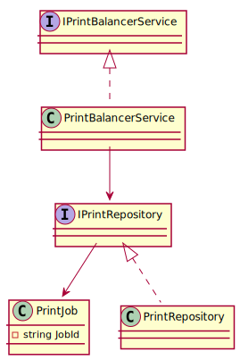

# Problem 2 - Print Server Load Balancer

## Overview

This console application simulates a basic print server that:

- Enqueues print jobs into a waiting queue
- Assigns them to the least-busy (idle) printers
- Tracks and completes jobs
- Reports current system status

Implemented with **Clean Architecture**, **SOLID** principles, and **Microsoft.Extensions.Hosting** for dependency
injection.

---

## Architecture

```
Problem2/
├── Cli/                    # Entry point
│   └── Problem2Runner.cs
├── Application/           # Orchestration logic
│   └── Services/
│       └── PrintBalancerService.cs
├── Domain/                # Business contracts and models
│   ├── Models/
│   │   └── PrintJob.cs
│   └── Interfaces/
│       ├── IPrintBalancerService.cs
│       └── IPrintRepository.cs
├── Infrastructure/        # In-memory repository implementation
│   └── PrintRepository.cs
├── Tests/                 # Unit tests
│   └── PrintBalancerServiceTests.cs
```

---

## 🔷 UML Diagram



---

## Design Highlights

### Data Structures Used

- **`Queue<PrintJob>`**: Manages job order (FIFO)
- **`Dictionary<string, PrintJob?>`**: Represents printers and their current jobs

These were chosen for their clarity and direct mapping to the problem domain (job scheduling and idle tracking).

### Business Logic

- Jobs are assigned in **arrival order**
- Only **idle printers** receive jobs
- `CompleteJob` verifies job-printer match before freeing the printer

---

## Sample Execution

```csharp
service.EnqueueJob("J1");
service.EnqueueJob("J2");
service.AssignNext();
service.AssignNext();
service.CompleteJob("Printer1", "J1");
service.AssignNext();
Console.WriteLine(service.Status());
```

Expected Output:

```
-- Waiting Jobs --
-- Printer Status --
Printer1: idle
Printer2: J2
```

---

## Unit Tests

Located in `Tests/PrintBalancerServiceTests.cs`.

Covers:

- Job queuing
- Assignment logic
- Completion logic
- Idle state validation
- Output formatting

All tests written with `xUnit` using Arrange-Act-Assert style. 100% code coverage confirmed.

---

## Run Instructions

```bash
dotnet run --project src/Problem2/Problem2.csproj
```

---

## References

- [Microsoft Docs – Dependency Injection](https://learn.microsoft.com/en-us/dotnet/core/extensions/dependency-injection)
- [Clean Architecture](https://www.planetgeek.ch/2020/12/14/clean-architecture-with-c/)
- [xUnit Testing](https://xunit.net/)
