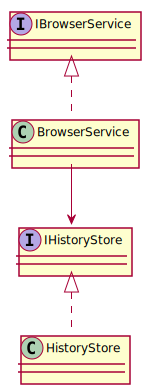

# Problem 3 - Browser History Navigation

## Overview

This application simulates a web browser's back and forward navigation system. It allows users to:

- Navigate to a new URL
- Go back to a previous page
- Move forward if a back action has been performed
- View the current page at any time

The system is built using Clean Architecture principles, SOLID design, and Microsoft.Extensions.Hosting for CLI
bootstrapping.

---

## Architecture

```
Problem3/
├── Cli/                    # Entry point
│   └── Problem3Runner.cs
├── Application/           # Navigation service
│   └── Services/
│       └── BrowserService.cs
├── Domain/                # Navigation interfaces
│   └── Interfaces/
│       ├── IBrowserService.cs
│       └── IHistoryStore.cs
├── Infrastructure/        # In-memory history tracking
│   └── HistoryStore.cs
├── Tests/                 # xUnit tests
│   └── BrowserServiceTests.cs
```

---

## 🔷 UML Diagram



---

## Design Highlights

### Data Structures Used

- `Stack<string>`: Used for both _back_ and _forward_ navigation history

The use of two stacks enables efficient LIFO navigation modeling for both directions.

### Navigation Rules

- `Navigate(url)`: Adds new URL, clears forward stack
- `Back()`: Moves to previous page if available
- `Forward()`: Returns to a page after a back operation
- `Current()`: Returns current page

---

## Sample Execution

```csharp
browser.Navigate("https://example.com");
browser.Navigate("https://google.com");
browser.Back();
browser.Forward();
browser.Navigate("https://github.com");
browser.Back();
Console.WriteLine("Current page: " + browser.Current());
```

Expected output:

```
Current page: https://google.com
```

---

## Unit Tests

Tests are found in `BrowserServiceTests.cs`. They cover:

- Navigation and current page tracking
- Back and forward mechanics
- Stack clearing after new navigation
- Edge cases like navigating without history

Written using `xUnit` and follow the Arrange-Act-Assert structure.

---

## Run Instructions

```bash
dotnet run --project src/Problem3/Problem3.csproj
```

---

## References

- [Microsoft Docs – Dependency Injection](https://learn.microsoft.com/en-us/dotnet/core/extensions/dependency-injection)
- [Clean Architecture – Robert C. Martin](https://8thlight.com/blog/uncle-bob/2012/08/13/the-clean-architecture.html)
- [xUnit Testing Framework](https://xunit.net)
