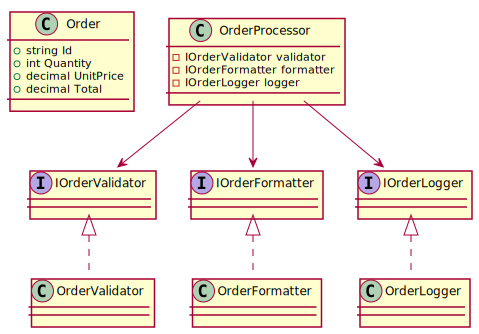

# Problem 4 - Single Responsibility Principle Refactor

## Overview

This problem demonstrates a full refactor of a monolithic order-processing method into multiple, SRP-compliant
components. Each class is responsible for a single concern, improving maintainability, readability, and testability.

---

## Architecture

```
Problem4/
├── Application/
│   └── Services/
│       └── OrderProcessor.cs
├── Domain/
│   ├── Interfaces/
│   │   ├── IOrderValidator.cs
│   │   ├── IOrderFormatter.cs
│   │   ├── IOrderLogger.cs
│   │   └── IOrderPrinter.cs
│   └── Models/
│       └── Order.cs
├── Infrastructure/
│   ├── OrderValidator.cs
│   ├── OrderFormatter.cs
│   └── OrderLogger.cs
├── Program.cs
├── Tests/
│   ├── OrderValidatorTests.cs
│   └── OrderFormatterTests.cs
```

---

## 🔷 UML Diagram



---

## Design Highlights

### Applied Principles

- **SRP (Single Responsibility Principle)**: Each class addresses one and only one reason to change.
- **Dependency Injection**: Configured via `Microsoft.Extensions.Hosting`
- **Testability**: Each unit has its own interface and corresponding test

### Component Responsibilities

| Component        | Responsibility                               |
|------------------|----------------------------------------------|
| `OrderProcessor` | Orchestrates validation, logging, formatting |
| `OrderValidator` | Validates order data                         |
| `OrderFormatter` | Formats output messages                      |
| `OrderLogger`    | Buffers and outputs logs to console          |

---

## Execution Flow

1. A list of hardcoded orders is defined.
2. Each order is validated:
    - If invalid, validation errors are logged.
    - If valid, it is formatted and logged.
3. Logs are printed to console via a `Flush()` call.

---

## Sample Output

```
Order A100: 2 × $15.50 = $31.00
Order B200: 1 × $99.99 = $99.99
Order C300: 5 × $7.25 = $36.25
[UTC timestamp] Invalid quantity for order D400
[UTC timestamp] Invalid price for order E500
```

---

## Unit Tests

Tests include:

- ✅ Valid and invalid order checks (`OrderValidatorTests`)
- ✅ Message formatting verification (`OrderFormatterTests`)

All tests follow Arrange–Act–Assert style using `xUnit`.

---

## Run Instructions

```bash
dotnet run --project src/Problem4/Problem4.csproj
```

---

## References

- [SRP - SOLID Principles](https://en.wikipedia.org/wiki/Single-responsibility_principle)
- [Microsoft Docs – Dependency Injection](https://learn.microsoft.com/en-us/dotnet/core/extensions/dependency-injection)
- [xUnit Testing](https://xunit.net)
