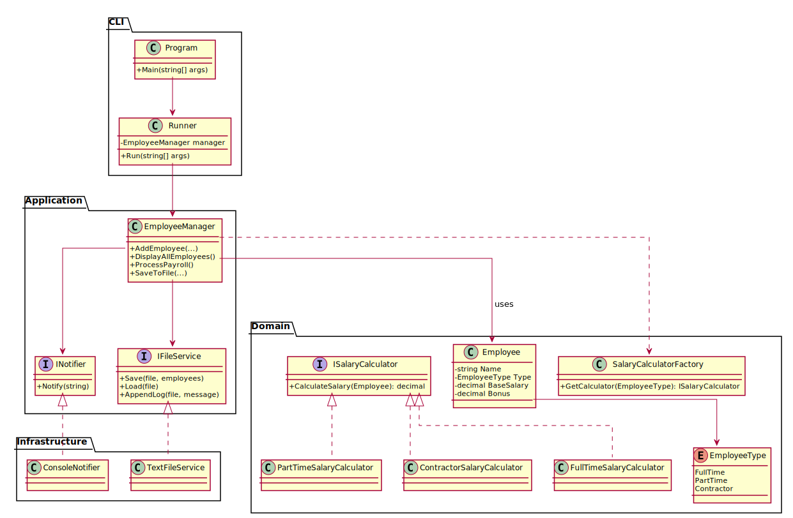

# 🧪 Employee Management System – Refactored (Exercise 1)

## 📌 Objective
Refactor legacy payroll system to modern C# design, improving maintainability, readability, and extensibility using Clean Architecture and SOLID principles.

## ✅ Summary of Improvements
- ✅ Strategy Pattern for salary logic
- ✅ Enum for employee types (no magic strings)
- ✅ SRP-compliant `EmployeeManager`
- ✅ Interfaces for file and notification services
- ✅ Dependency injection with Microsoft.Extensions.Hosting
- ✅ Entry logic moved to `Runner` class for orchestration

## 🧩 Design Patterns
| Pattern               | Purpose                          |
|----------------------|----------------------------------|
| Strategy             | Salary logic by employee type    |
| Factory              | Select calculator at runtime     |
| Dependency Injection | Replaceable I/O & UI components  |

## 🧱 Architecture Overview
This project uses a Clean Architecture-style layering:

```
Program.cs        → sets up dependencies and starts Runner
Runner.cs         → coordinates main logic via CLI args
EmployeeManager   → core application logic
Employee, Salary* → domain layer
INotifier, IFile* → adapter interfaces
ConsoleNotifier, TextFileService → concrete infrastructure
```

## 🔷 UML Diagram




## 🧪 Tests
- `EmployeeManagerTests`: Moq + xUnit
- `SalaryCalculatorTests`: Salary strategy logic

## 🚀 CLI Usage
You can pass employees as arguments:

```bash
dotnet run -- "John Doe,FullTime,5000,500" "Jane Smith,PartTime,3000,200"
```

Each argument must follow the format:
```
Name,Type,BaseSalary,Bonus
```

## 📁 Structure
```
EmployeeManagementSystem/
├── Cli
│   ├──Program.cs
│   ├──Runner.cs
├── Domain/
│   ├── Employee.cs
│   ├── EmployeeType.cs
│   ├── ISalaryCalculator.cs
│   └── SalaryCalculator implementations
├── Application/
│   └── EmployeeManager.cs
├── Infrastructure/
│   ├── IFileService.cs, TextFileService.cs
│   └── INotifier.cs, ConsoleNotifier.cs
└── README.md

EmployeeManagementSystem.Tests/
├── EmployeeManagerTests.cs
└── SalaryCalculatorTests.cs
```