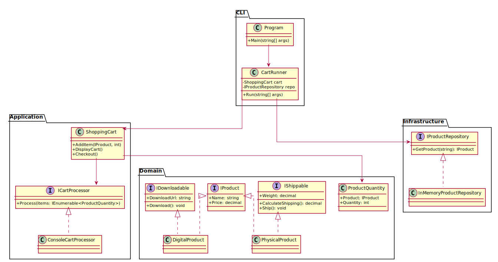

# 🛒 ShoppingCartSystem – Refactored (Exercise 2)

## 📌 Objective
Refactor a basic shopping cart system to follow Clean Architecture and SOLID principles, while supporting extensible product types and behaviors.

## ✅ Summary of Improvements
- ✅ Separated interfaces: `IProduct`, `IShippable`, `IDownloadable`
- ✅ Applied `Strategy`-like pattern for cart processing (`ICartProcessor`)
- ✅ Used `HostBuilder` with full dependency injection
- ✅ Introduced `CartRunner` to handle CLI entry
- ✅ Removed magic strings/numbers
- ✅ Unit tests using `xUnit` + `Moq`

## 🧩 Design Patterns
| Pattern               | Usage                                |
|----------------------|--------------------------------------|
| Strategy             | Cart processing (shipping, download) |
| Interface Segregation| Split product capabilities            |
| Dependency Injection | Services and repositories            |

## 🧱 Architecture Overview
```
CLI (Program.cs → CartRunner)
→ Application (ShoppingCart, ICartProcessor)
→ Domain (Product abstractions, behaviors)
→ Infrastructure (Repo, Console handlers)
```

## 🚀 CLI Usage
```bash
dotnet run -- "Laptop:1" "EBook" "Mouse:2"
```
- `ProductName[:Quantity]`
- Default quantity = 1 if omitted

## 🔷 UML Diagram



## 📁 File Structure
```
ShoppingCartSystem/
├── Cli
│   ├── Program.cs
│   ├── CartRunner.cs
├── Application/
│   ├── ShoppingCart.cs
│   ├── ICartProcessor.cs
│   └── ConsoleCartProcessor.cs
├── Domain/
│   ├── IProduct.cs
│   ├── IShippable.cs
│   ├── IDownloadable.cs
│   ├── ProductQuantity.cs
│   ├── PhysicalProduct.cs
│   └── DigitalProduct.cs
├── Infrastructure/
│   ├── IProductRepository.cs
│   └── InMemoryProductRepository.cs
└── README.md

ShoppingCartSystem.Tests/
├── ShoppingCartTests.cs
└── ProductTests.cs
```

## 🧪 Tests
- ✅ Coverage for product behavior (`Ship`, `Download`, `ShippingCost`)
- ✅ Verification of cart quantity logic
- ✅ Calculation of total price including shipping
